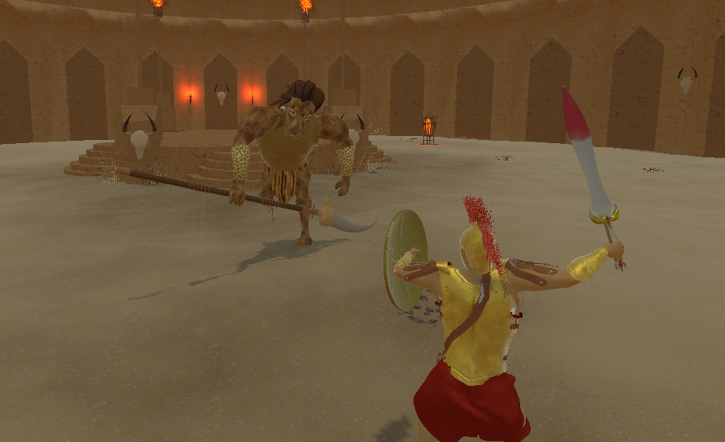

<iframe
width="720"
height="405"
src="https://www.youtube.com/embed/ym3PQGVJHcY?autoplay=1"
title="YouTube video player"
frameborder="0"
allow="autoplay; encrypted-media"
allowfullscreen>
</iframe>

# Introduction

This project was created in Unity and was my final year group project while at university. The aim was to create a game 
by going through all the stages of game production which included a Pitch and Prototype at the start of the year which 
would then be further developed throughout the year.

# Objectives

# Development

# Character Controller

One of the main features I worked on was the Players character controller. Using Unity’s animator, I was able to create 
a fluid system that used root motion animations to move the character and perform a variety of attacks. 

For the main movement, I was able to create a blend tree to move the character in 8 different directions. Using a custom
float value, I was able to determine whether the player was walking or running and change the animation style based on 
this. I was also able to implement turning animations for when the players input exceeded over 180 degrees from the 
current direction they were facing.

  

      <video 
        src="/videos/walk_run.mp4" 
        autoplay 
        muted 
        loop 
        playsinline 
        style="width: 50%; border-radius: 12px;">
      </video>
      
    

The player has several attacks at their disposal, ranging from a basic attack combo to a lethal jumping attack

In order to create the combo attacks, I made use of the events tab in the animation window to create a small window that
listens to see if the player has pressed either the normal or heavy attack button. This would then blend the basic attack
into the next animation by using the inbuilt animation blend feature.

Certain conditions were established to assess the player's ability to execute the attack. This involved verifying whether
the player possessed sufficient stamina to initiate the attack or if the player had undergone an attack, transitioning 
them from the attacking animation to a damaged state.

I was also able to utilize a blocking animation by using an animation mask for the player. This allowed me to blend the 
blocking animation over the top of movement animations, allowing the player to move while blocking. Using code, I 
implemented a lerp to gradually blend into the blocking layer, to which I was able to define that when the player was
only blocking when they have fully completed the blocking animation. This would also react to when the player was hit by
an attack to trigger a stagger effect, giving the player visual feedback that they had successfully blocked an attack. 

When it came to the players dodge roll, I created custom animation events when the animation played for the player to 
avoid damage. These custom events would trigger code near the start and end of the animation to provide invulnerability
frames. This would also multiply the players forward transform by a custom roll distance variable to enable the player
to have a speed boost during rolling to cover more distance, making the dodge more useful.

# Tutorial and Dialogue systems

To teach the player how to play our game, I implemented a tutorial at the start for the player to complete. Throughout
this tutorial, the player would learn all the basics of player movement and combat, along with delivering the main story
narrative of our game.

The player will start by being woken up in their cell by a guard which welcomes them to the trials of IX. From here the 
player will learn how to exit their cell and gather their equipment by walking to one of the weapons stands. After this,
the guard will prompt the player to perform their attacks on another prisoner to advance the tutorial.

To teach the player how to play our game, I implemented a tutorial at the start for the player to complete. Throughout 
this tutorial, the player would learn all the basics of player movement and combat, along with delivering the main story
narrative of our game.

The player will start by being woken up in their cell by a guard which welcomes them to the trials of IX. From here the 
player will learn how to exit their cell and gather their equipment by walking to one of the weapons stands. After this,
the guard will prompt the player to perform their attacks on another prisoner to advance the tutorial.

To deliver the main narrative of the game and to guide the player, we also needed a dialogue system to communicate with 
the player.

I created some UI elements which could hold the text and attached a custom dialogue script. This dialogue consisted of 
creating a dictionary to hold all of the possible conversations and filtered them into the UI box by generating and 
typing out the sentence at a given speed.

I also added in checks to see if the player had communicated with the NPC. This allowed the player to see if they needed
to talk to a NPC by displaying the IX logo above their head. A red marker would indicate the main tutorial to complete, 
while the yellow marker would show NPC's that would provide lore to the player.

The NPC’s also have different states that they can be in, such as Idle, Walk and Talking. When communicating with the 
player, the NPC will also rotate to face where the player is standing.

When the tutorial has been completed, the gate to the next stage of the arena will open using a custom animation. To 
prevent the player from replaying this tutorial when entering this area again, a JSON file will be created when the 
player passes through the gate which stores a variable stating that the player has completed the tutorial.

# Custom Shaders

I created a fire shader that was used throughout the scenes in sconces and fire pits. I was able to do this by taking an
image of a flame and applying noise to it with the Voronoi node in the shader graph. After creating some custom variables 
that controlled the fires DissolvePower, DissolveScale and DissolveSpeed I was able to multiply them together to create 
the fire effect.

To create the death effect, I created a shader that takes a texture from the player and then transitions it to a stone 
texture. This then has a dissolve effect applied over it using the noise, step and multiply nodes within the visual scripter.
I then manipulated it with code by using a co routine and a refresh rate variable to gradually swap between the player 
and stone textures which would cycle through all the listed materials. I then added the previous fire shader with a 
different colour to add more flare to the transition.

I was able to add in a wobble on the X and Y axis and feed it into the fill of the bottle. Along with this I was able to
add in a colour node to get it to resemble a health potion. After this, I attached a script to the potion which would 
interact with the nodes on the shader and the material. The script is able to take the X and Y rotation of the of the 
last location of the fluids fill amount along with adding a clamp to the velocity.

# Testing

Throughout the year, we further Developed the game by doing rigorous Testing sessions. These sessions would consist of
either displaying the game for our class, or to the whole university by having it displayed in the front entrance of the
university. Throughout these sessions, we would gain feedback by getting the participants to fill out a curated 
questionnaire which we would revise and work into further development of our game.

# Motion Capture

As we wanted to have custom animations for our main character and bosses, we were fortunate enough to be able to spend 
some time with the motion capture department with our University.

This was an amazing opportunity to learn about motion capture and was a worthwhile experience to learn about the process
of recording animations and fully implementing them into the game.

Even though we weren't able to use all of the recorded animations from that day, the ones we did use proved to be useful
and turned out amazing.

# Marketing

Another major component to the course was to create marketing materials for our game. Using some of our in game assets 
and logo we were able to create some amazing T-shirts, custom stickers and even a game poster to help promote our game.

# Outcome

I learned a great deal from this project and feel that it represents the culmination of everything I have learned so far
within the Unity Engine. While I had created many character controllers prior to this, this was the first time I developed 
one entirely from scratch, complete with full animations. This project provided an invaluable opportunity to follow the
entire process, from recording an animation to importing it into Unity.

Working with the Motion Capture studio at the University was an amazing experience, and I'm glad I pushed my team to get
involved. The entire team was incredible, and we all engaged in extensive self-study to achieve the first-class grade we
received. I'm proud of the game we created together and the dedication and teamwork that made it possible.
